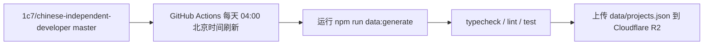
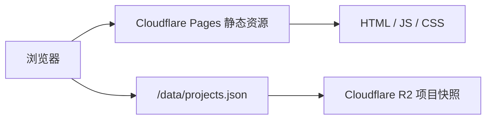

<p align="center">
  
</p>

<h1 align="center">Vibe Coding Atlas</h1>

> 品牌标识结合了代码括号和双手捧着小火星的意象，寓意开发者用代码托起新的灵感与创意。

收录和整理中国独立开发者项目，提供搜索、筛选、排序、精确收录日期和项目所附公开仓库的 GitHub Stars。数据来源：[chinese-independent-developer](https://github.com/1c7/chinese-independent-developer)。

正式站点：<https://vibecoding.aicake.io>

## 本地运行

```bash
npm install
git clone --depth=1 https://github.com/1c7/chinese-independent-developer.git source
npm run data:generate
npm run dev
```

默认从项目内的 `source/` 读取上游清单，也可以通过 `SOURCE_REPO` 指定已有 checkout 路径。`npm run data:generate` 会把本地快照写入被忽略的 `public/data/projects.json`，方便 `npm run dev` 通过 `/data/projects.json` 加载。设置 `GITHUB_TOKEN` 或 `GH_TOKEN` 后会通过 GitHub 官方 API 刷新 Stars；没有 Token 时保留已有 Stars 快照。

本机已登录 GitHub CLI 时，`npm run data:generate` 会在没有 `GITHUB_TOKEN` / `GH_TOKEN` 的情况下自动尝试 `gh auth token`，临时用于刷新 GitHub Stars。Token 不会写入项目文件；远程 GitHub Actions 仍使用自动注入的 `${{ github.token }}`。

## 验证与构建

```bash
npm run typecheck
npm run lint
npm test
```

`npm run build` 生成可直接发布到 Cloudflare Pages 的 `dist/`。项目资料来自上游仓库，GitHub Stars 仅对应清单中能够识别出的公开仓库链接。

## 自动更新

GitHub Actions 每天凌晨 4:00（北京时间）检查
[chinese-independent-developer](https://github.com/1c7/chinese-independent-developer) 的 `master` 分支，重新生成项目资料并刷新 GitHub Stars。验证通过后，工作流把 `projects.json` 上传到 Cloudflare R2，网页运行时通过 `/data/projects.json` 读取最新快照。

工作流也可以在 GitHub Actions 页面手动触发。GitHub Stars 使用 GitHub 自动提供的 `${{ github.token }}`；上传 R2 需要在本仓库配置 `CLOUDFLARE_ACCOUNT_ID`、`R2_BUCKET`、`R2_ACCESS_KEY_ID` 和 `R2_SECRET_ACCESS_KEY` 四个 GitHub Actions Secrets。

## 运行流程

数据刷新和浏览器访问是两条独立链路：





## 部署

Cloudflare Pages 项目 `vibe-coding-atlas` 通过 GitHub Integration 跟踪 `main` 分支，使用 `npm run build` 构建并发布 `dist/`。项目数据托管在 Cloudflare R2 bucket，推荐给 R2 绑定自定义域名，并在 Cloudflare 规则中把 `https://vibecoding.aicake.io/data/projects.json` 路由到 R2 对象，避免经过 Pages Functions / Workers。

### Cloudflare 凭据

R2 上传使用 R2 S3-compatible API token，而不是 Wrangler 的 OAuth token 或账号级 Cloudflare API Token。推荐创建只绑定 `vibe-coding-atlas-data` bucket 的 **Object Read & Write** token，并把生成的 S3 凭据写入本地 `.env.cloudflare`：

```dotenv
CLOUDFLARE_ACCOUNT_ID=你的 Cloudflare Account ID
R2_BUCKET=vibe-coding-atlas-data
R2_ACCESS_KEY_ID=R2 Access Key ID
R2_SECRET_ACCESS_KEY=R2 Secret Access Key
```

可以在 Cloudflare R2 的 **Manage R2 API Tokens** 页面手动创建同等权限的 token，也可以使用本机已有的安全凭据流程在仓库外创建；项目只要求最终把上面的四个变量填入本地 `.env.cloudflare`。本机已登录 GitHub CLI 后，把这些值写入当前 GitHub 仓库的 Actions Secrets：

```bash
npm run secrets:github
```

如果不在仓库目录执行，显式指定目标仓库：

```bash
npm run secrets:github -- --repo xiaomingio/vibe-coding-atlas
```

## License

项目代码采用 [GPL-3.0](./LICENSE) 开源。

`Vibe Coding Atlas` 的名称、Logo 和域名不随代码授权。如果基于本项目 fork 或二次开发成自己的产品，请使用自己的名称、Logo 和域名，并注明项目来源，避免和本站混淆。
