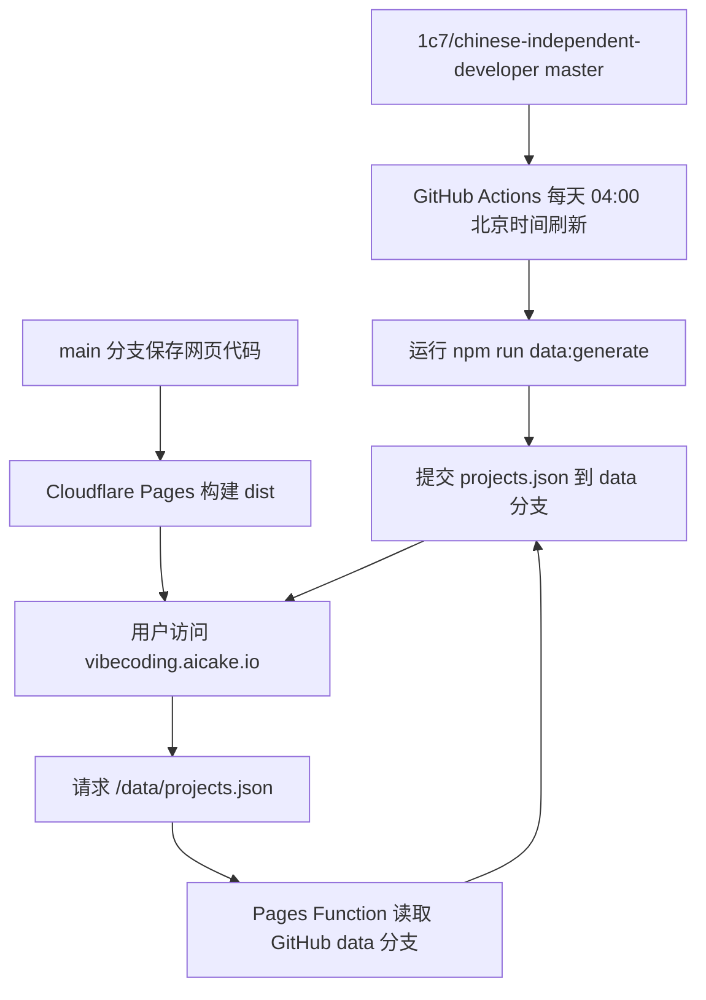

# Vibe Coding Atlas

把 [chinese-independent-developer](https://github.com/1c7/chinese-independent-developer) 的项目清单整理成可搜索、筛选、排序的静态网页目录，并展示精确收录日期和项目所附公开仓库的 GitHub Stars。

正式站点：<https://vibecoding.aicake.io>

## 本地运行

```bash
npm install
git clone --depth=1 https://github.com/1c7/chinese-independent-developer.git source
npm run data:generate
npm run dev
```

默认从项目内的 `source/` 读取上游清单，也可以通过 `SOURCE_REPO` 指定已有 checkout 路径。`npm run data:generate` 会把本地快照写入被忽略的 `public/data/projects.json`，方便 `npm run dev` 通过 `/data/projects.json` 加载。设置 `GITHUB_TOKEN` 或 `GH_TOKEN` 后会通过 GitHub 官方 API 刷新 Stars；没有 Token 时保留已有 Stars 快照。

## 验证与构建

```bash
npm run typecheck
npm run lint
npm test
```

`npm run build` 生成可直接发布到 Cloudflare Pages 的 `dist/`。项目资料来自上游仓库，GitHub Stars 仅对应清单中能够识别出的公开仓库链接。

## 自动更新

GitHub Actions 每天凌晨 4:00（北京时间）检查
[chinese-independent-developer](https://github.com/1c7/chinese-independent-developer) 的 `master` 分支，重新生成项目资料并刷新 GitHub Stars。快照有变化时提交到 `data` 分支的 `projects.json`，`main` 分支只保存网站代码。

工作流也可以在 GitHub Actions 页面手动触发；它只使用 GitHub 自动提供的 `GITHUB_TOKEN`，不需要在 GitHub 配置 Cloudflare 凭据。

## 运行流程



## 部署

Cloudflare Pages 项目 `vibe-coding-atlas` 通过 GitHub Integration 跟踪 `main` 分支，使用 `npm run build` 构建并发布 `dist/`，再由 Pages Function 提供同源 `/data/projects.json` 数据接口。GitHub 不保存 Cloudflare API Token 或 Account ID。
